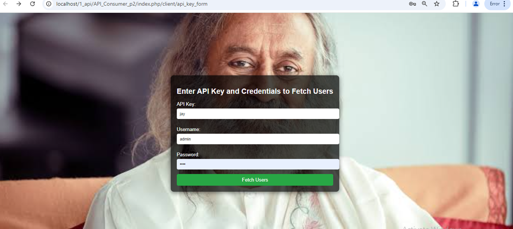
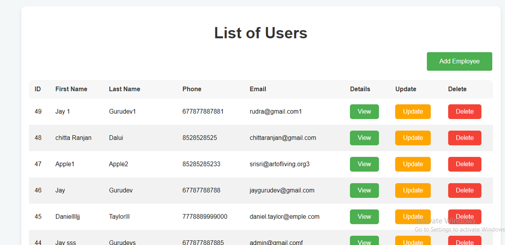
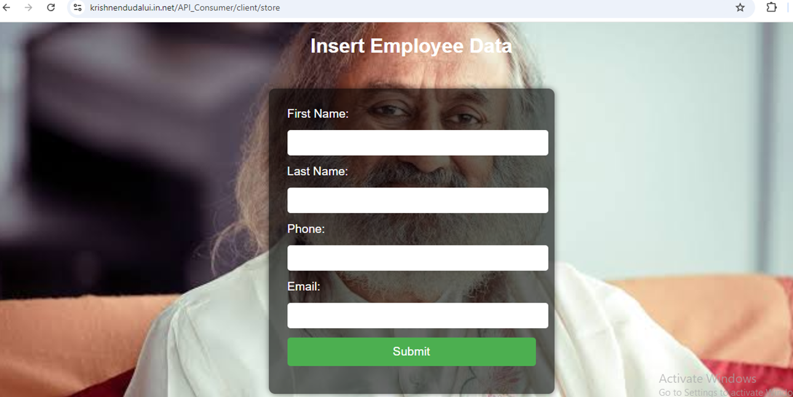
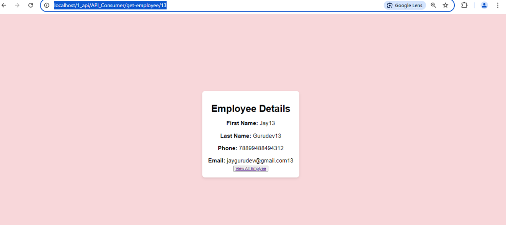
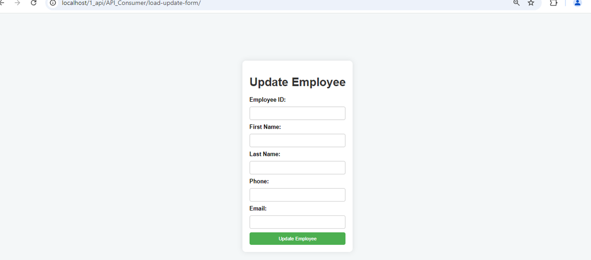
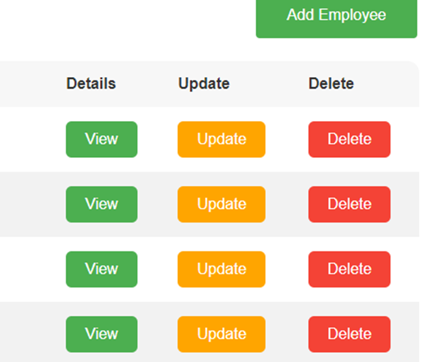

# CodeIgniter REST API consumer -V2 Setup

This guide will walk you through setting up two CodeIgniter projects: the first project acts as an API Provider (exposing data via a REST API), and the second project acts as an API Consumer (fetching data from the first project's API).

---

## **Project 2: API Provider-V2**

### Step 1: Download Local host  project
- 🌱 Prject name  **REST API ,REST API CONSUMER in CI3 _V2 **
- 👨‍💻 Local host  Link [http://localhost/1_api/API_Consumer_p2/index.php/client/api_key_form](http://localhost/1_api/API_Consumer_p2/index.php/client/api_key_form)

### Step 2: Github Link
-- 🌱 Prject name  **REST API ,REST API CONSUMER in CI3 _V2 **

- 👨‍💻  Github Link [https://github.com/Code-with-nandu/API_Consumer_p2](https://github.com/Code-with-nandu/API_Consumer_p2)

### Step 3: Full note  Link
- 🌱 Prject name  **REST API ,REST API CONSUMER in CI3 _V2 **

- 👨‍💻  Full note  Link [https://docs.google.com/document/d/1-hiv-9v3-ndF4CtkKj_VtMgFjfqXNw47/edit](https://docs.google.com/document/d/1-hiv-9v3-ndF4CtkKj_VtMgFjfqXNw47/edit)

### Step 4: Short note Link
- 🌱 Prject name  **REST API ,REST API CONSUMER in CI3 _V2 **

- 👨‍💻  Short note Link [https://docs.google.com/document/d/1-icnVovPL-oddN2Ax_qZeLbukSWWMGF7/edit](https://docs.google.com/document/d/1-icnVovPL-oddN2Ax_qZeLbukSWWMGF7/edit)

### Step 5: API key credentials :
Api key : jay
Username: admin
Password :1234

### Step 6: 
- 🔭 API key credentials   [https://krishnendudalui.in.net/API_Consumer_p2/index.php/client/api_key_form ](https://krishnendudalui.in.net/API_Consumer_p2/index.php/client/api_key_form)

### Step 7: 
- 📝 List of Users [https://krishnendudalui.in.net/API_Consumer_p2/ApiClientController/get_users](https://krishnendudalui.in.net/API_Consumer_p2/ApiClientController/get_users)

### Step 8: 
- 👨‍💻 Add Employee  [https://krishnendudalui.in.net/API_Consumer_p2/client/store](https://krishnendudalui.in.net/API_Consumer_p2/client/store)

### Step 9: 
- 🔭 Employee Details  [https://krishnendudalui.in.net/API_Consumer_p2/get-employee/49 ](https://krishnendudalui.in.net/API_Consumer_p2/get-employee/49)

### Step 10: 
- 📝 Update Employee [https://krishnendudalui.in.net/API_Consumer_p2/load-update-form/49](https://krishnendudalui.in.net/API_Consumer_p2/load-update-form/49)

### Step 11: 
- 👨‍💻 Delete This Employee  [https://krishnendudalui.in.net/API_Consumer_p2/client/get_users](https://krishnendudalui.in.net/API_Consumer_p2/client/get_users)

### Step 12: 